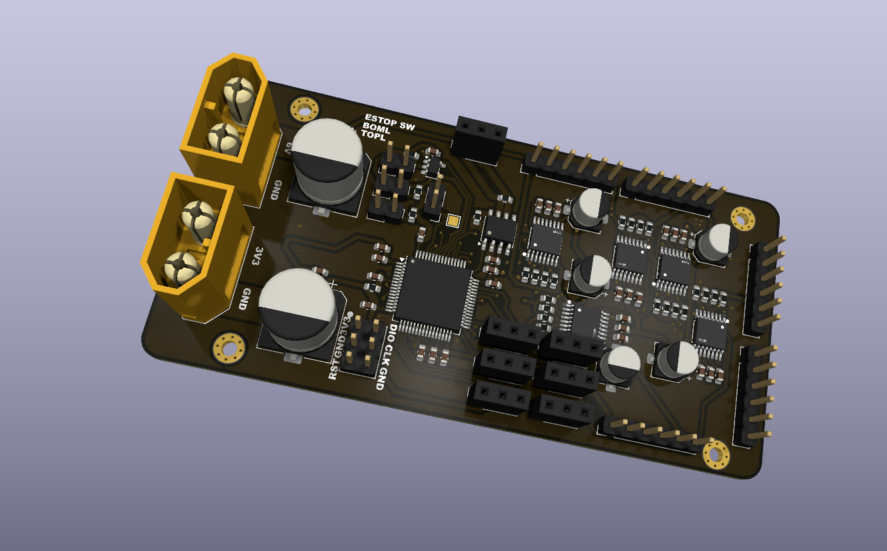

# Aryan's Project Journal
---
title: "AgriRover"
author: "Aryan-git-byte"
description: "Lorem Ipsum"
---
# Entries:

```
Date: 16|09|2026
Title: Started setting up the project
Lapse: https://lapse.hackclub.com/timelapse/ZzH1Qx-fRISk
```
I started setting up the repo, and invite my collaborator along with me. After that i started researching about the Motor to be used i found some general ones from robu.in such as https://robu.in/product/jgb37-520-dc12v-miniature-forward-and-reverse-brushed-dc-speed-reducer-motor/
but none of them sitted with our requirements.
After this i started writing the NOTES.md to put down everything i researched and thought about this project. i gathered references and scope down the features. after that i searched the sbc for our edge calculations and visions etc. for which i chose RADXA CM3.
after that i started making the kicad file, and put down the motor headers which i chose this one: https://www.digikey.in/en/products/detail/dfrobot/FIT0522/7682227
then i layed their headers in schematic. 
then i started researching abbout the motor driver to use, i took some help with AI during this process. and landed down on drv8874pwpr to be used as motor driver, due to its current capacity of 6A.


```
Date: 19|09|2026
Title: Layed out the schematic
Lapse: https://lapse.hackclub.com/timelapse/kJue3J3v57nF
```
I started by reading the datasheet of the motor driver, and laying out the passives component.
i made the motor driver schematic referencing the datasheet.

I layed out the motor drivers in different sheet and started laying it out.
After that i moved onto the MCU part of the schematic, for which i chose STM32G431R6Tx. i started reading its passive and laying out.
in between that i even searched for LiDar, and camera module to be used. i wrote the servo requirements along with my partner. and started laying down its schematic.
i put down all the capacitors, resistors and all required for it to work including reset circuitory, boot, etc.
i even put a CAN transceiver for cross-board communication. and assigned all the GPIOs .
I added two stop switch and 1 estop button.
then i assigned some components with their footprint. and in between that my electricity went off.....


```
Date: 20|09|2026
Title: Completed the actuator PCB
Lapse: https://lapse.hackclub.com/timelapse/kJue3J3v57nF, https://lapse.hackclub.com/timelapse/HPhRJ8Zc8nlh
```
i Started by completing the Footprint assignment, and converted the schematic to PCB. i even assigned 3d models to the IC. and started laying it out.
it was lwky fun to do it. and i layed out all components accordingly, each IC with their respective passives.
then i started routing all the PCB and completed the routing and layout, after which it look:

which was lowk very cool
and yeah obv i had like 100+ DRCs so i fixed them one by one ,changed some layer properties. and at last added the mounting holes and silkscreens.

```
Date: 20|09|2026
Title: Starting workin on CM4 board
Lapse: https://lapse.hackclub.com/timelapse/phq3_oZRzSBn, https://lapse.hackclub.com/timelapse/WciFVV_d-N2p
```

this time i started by laying out the CM4 board schematic referencing the CM4 IO board given by raspberry pi.
I imported it and started making the headers for camera, wake up circuitory, RTC etc.
I put down the HDMI, USB, CAN transceiver etc
and that was it for today. Cyaa!