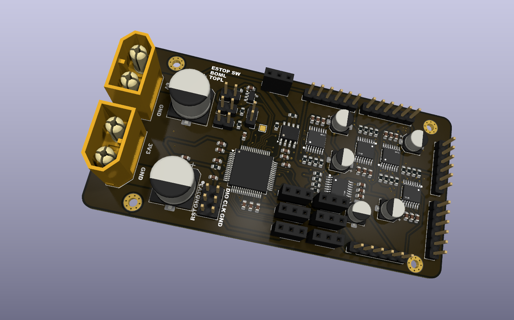

---
title: "AgriRover"
author: "Aryan-git-byte"
description: "Lorem Ipsum"
---
# Entries:

```
Date: 16|09|2026
Title: Started setting up the project
Lapse: https://lapse.hackclub.com/timelapse/ZzH1Qx-fRISk
```
I started setting up the repo, and invite my collaborator along with me. After that i started researching about the Motor to be used i found some general ones from robu.in such as https://robu.in/product/jgb37-520-dc12v-miniature-forward-and-reverse-brushed-dc-speed-reducer-motor/
but none of them sitted with our requirements.
After this i started writing the NOTES.md to put down everything i researched and thought about this project. i gathered references and scope down the features. after that i searched the sbc for our edge calculations and visions etc. for which i chose RADXA CM3.
after that i started making the kicad file, and put down the motor headers which i chose this one: https://www.digikey.in/en/products/detail/dfrobot/FIT0522/7682227
then i layed their headers in schematic. 
then i started researching abbout the motor driver to use, i took some help with AI during this process. and landed down on drv8874pwpr to be used as motor driver, due to its current capacity of 6A.


```
Date: 19|09|2026
Title: Layed out the schematic
Lapse: https://lapse.hackclub.com/timelapse/kJue3J3v57nF
```
I started by reading the datasheet of the motor driver, and laying out the passives component.
i made the motor driver schematic referencing the datasheet.

I layed out the motor drivers in different sheet and started laying it out.
After that i moved onto the MCU part of the schematic, for which i chose STM32G431R6Tx. i started reading its passive and laying out.
in between that i even searched for LiDar, and camera module to be used. i wrote the servo requirements along with my partner. and started laying down its schematic.
i put down all the capacitors, resistors and all required for it to work including reset circuitory, boot, etc.
i even put a CAN transceiver for cross-board communication. and assigned all the GPIOs .
I added two stop switch and 1 estop button.
then i assigned some components with their footprint. and in between that my electricity went off.....


```
Date: 20|09|2026
Title: Completed the actuator PCB
Lapse: https://lapse.hackclub.com/timelapse/kJue3J3v57nF, https://lapse.hackclub.com/timelapse/HPhRJ8Zc8nlh
```
i Started by completing the Footprint assignment, and converted the schematic to PCB. i even assigned 3d models to the IC. and started laying it out.
it was lwky fun to do it. and i layed out all components accordingly, each IC with their respective passives.
then i started routing all the PCB and completed the routing and layout, after which it look:

which was lowk very cool
and yeah obv i had like 100+ DRCs so i fixed them one by one ,changed some layer properties. and at last added the mounting holes and silkscreens.

```
Date: 20|09|2026
Title: Starting workin on CM4 board
Lapse: https://lapse.hackclub.com/timelapse/phq3_oZRzSBn, https://lapse.hackclub.com/timelapse/WciFVV_d-N2p
```

this time i started by laying out the CM4 board schematic referencing the CM4 IO board given by raspberry pi.
I imported it and started making the headers for camera, wake up circuitory, RTC etc.
I put down the HDMI, USB, CAN transceiver etc
and that was it for today. Cyaa!

```
Date: 26|09|2026
Title: Completed the schematic of the Carrier board
Lapse: https://lapse.hackclub.com/timelapse/qsf_A7LEaacM
```

I started working from where i left last week. by adding the passive to the CAN Circuitory, then i researched about the LiDar and find out its pinout :

and added the connector for it. Then i researched about the IMU to be used and decided to use ISM330DHCX.
after that i copied the HDMI from the IO board reference schematic and added ESD protections. 

then i started adding those nets to the cm4 symbol. then i added the config headers, to configure things such as boot, Enable, sync in out etc.

then i added the Sd card connector and its passive. moved on with other things such as 40 pin rpi header. etc


arranged all the symbols, put boxes etc. then completed the schematic by adding the watchdog, and RTC
then i assigned all the GPIOs and started assigning symbols with their respective footprints. in this time it was hard to get teh footprint for sd card- shoo
settled with the one provided in Guide. fixed all the footprints issues, and then started assigning the 3d model of each which took a fair time - credited to the USB and sd card.


```
Date: 26|09|2026
Title: Started layout-ing the PCB
Lapse: https://lapse.hackclub.com/timelapse/V1e4VZQfl5YC
```

Started converting the schematic to pcb then started layout-ing the pcb by having that bigass 40 header jumper as the reference:

started reading the datasheet of pcf for its layout guide but then remembers i m layouting SN65HVD230, ooh god. but nvm, moving on i find its layout guide. and started layouting the rest of it . fixed some crytal footprint issue. then it was smwhat layouted :

but a lot was still leftou-

```
Date: 27|09|2026
Title: Completed the layout and smwhat routing
Lapse: https://lapse.hackclub.com/timelapse/uzZOI6DcGz_z
```
started by layout-ing rest of the passives then i started routing the HDMI had to watch some tutorials since it wasnt routing bruh.and istg ts was so neat:


then i routed the ethernet which took me 20 min to just figure out bruh. then had to fine tune it 
and here are we with a sphaghetti. then routed somewhat sd card. and closed the lapse.

```
Date: 27|09|2026
Title: Completed the layout and smwhat routing
Lapse: https://lapse.hackclub.com/timelapse/eW_Bg22CGUb4
```
this time i started by making the board 4 layer.and started routing all the left out power, gpios etc since high speed signals were done.even had to make it 6 layer later on.and with some brain dead moments i was done with routing:


# Aryan's Project Journal
here ya go,


```
Date: 27|09|2026
Title: Tried to write the stm32 firmware
Lapse: https://lapse.hackclub.com/timelapse/8Bd7vpZjyi8r
```
Started by writing the journal, and README.
then tried the stm32 mx , installed it . and started doing the configs.
ts was so confusing but some guides and AI helped me thru it. and did this much:


and some channel thingy were bit confusing, so need to study about that.
```
Date: 03|10|2026
Title: Rerouted the CM4 IO
Lapse: https://lapse.hackclub.com/timelapse/7rZrdbDsi1q3
```
Starting i thought that ill just fix the DRC issues and move ahead, but working on it needed me to reroute it as it was beyond saving due to the no. of vias i used near the right side connector. so had to delete all the routing done prvsly. and started routing it again, starting with HDMI and the camera connector.
then connected the Ethernet and tuned its length to match its pair. after connecting the HDMI, camera, and ethrernet. i started doing all the GPIO connectors , SD card and allat stuff.
was doing high speed stuff on first layer, then plain grnd layer. then work with normal stuff in last 4. with gnd plane too.
i hope it doesnt generate EMI and stuff lmao, scarie.
then i started searching connector for the power and settled with JST-XH. connected everything else, fixed DRCs which took a while, most of them were unconnected GNDs and Clearance violation which was severe, s oi fixed which needed to be otheri just opted in for advance pcb in jlcpcb and checked the prices lmao! which was like 30-ish usd for 6 layer pcb, capped via and stuff. reasonable tbh

after that i completed that main board and moved on to the radio board, first of all i scoped it out so i dont end up adding anything later. 
goal was clear, GPS, LTE, LoRa. thats it.
i copied the SIM7080 schematic from another project of mine which was tested. and added other stuff such as LoRa and MT3608 boost converter to convert the 3v3 coming from the header to the sim7080G. bsaically the design idea was to design as a shield that can be added onto the main board with that 40 pin connector.


```
Date: 04|10|2026
Title: Completed the radio board and started some shi for the power board
Lapse: https://lapse.hackclub.com/timelapse/v5VnK2nqmpeG
```
started by writing out the pinout of the cm4 that i connected with all the sensors and stuff. 

```text
GPIO13- RXD (lunahawk lidar)
GPIO12 - TXD
GPIO11 - SCK 
GPIO09 - MISO
GPIO10 - MOSI
GPIO7 - IS_CS
GPIO8 - MC_CS
GPIO25 - INT
GPIO24,23 - INT1,2
```
after that i started by searching the inductors and stuff for the radio board. after that i had to fix a mistake that i powered the servo sockets with the 3v3 which wont work lol, so changed it to 6V.
after that i calculated the current and was summing up around 35A which was sceri asf tbh. so i decided to split up the 6V thing in two connectors instead of one 30A. so easier to handle later. i changed xt60 to xt30 connectors, added 3d models of their, added all capacitor and stuff and rerouted

after doing that, i came back to the radio board and added a I2C header to connect to the power board so that it can report to the CM4. and after that i started layouting the PCB and routing it which was ehh easy obv lol. here it is after doing allat 

and here it is connected to the main board 

which i rendered rq in fusion 360.

After completing that part i started working on the main powr shi searching the batteries, solar panel etc. for the battery i decided:
https://robu.in/product/pro-range-ifr-32650-lifepo4-30000mah-12-8v-4s5p-protected-battery-pack-3c/
and its charger 
https://robu.in/product/battery-charger-4s-lifepo4-14-6v-5a-with-xt60-connector/

and this solar panel:
https://www.amazon.in/WAAREE-Modules-Charging-Performance-Warranty/dp/B0F1D9YT9B
its a 60W one, that'd power it for uh like 1-2 extra hours ,meh but still better smthg than nthg.

after i started making the schematic of the LM5154 and another buck which was LMR33640ADDA. made one copied it 3 times. for 5v, 3v3, and 3v3_sub
since the lm5154

thing was rottingmy brain i thought i shall give it a rest and focus on documenting it 
but i opened canva, stopped lapse and went out for few moment came back and decided to continue the schematic anyways lmao.
after that i pushed everything and stopped timelapse.

```
Date: 04|10|2026
Title: completed the buck section, and writing the journals
Lapse: https://lapse.hackclub.com/timelapse/zhegiiK2k-wa
```
Started by putting in values for all the passive by getting them calculated from claude, its good man.like AI has been so good recently. altho ill need to check all that next time again to verify . after that i added some values for the MOSFET, selected CSD18534Q5A and changed some values according to that.
then started writing the journals and pushed that .

heres the schematic rn:

and then i stopped the lapse

```
Date: 04|10|2026
Title: Reformated the README
Lapse: https://lapse.hackclub.com/timelapse/j0HzOHwg0YSu
```
Wrote the journal for the last lapse, and then also added every PCB, schematic to the readme and introduced em :

