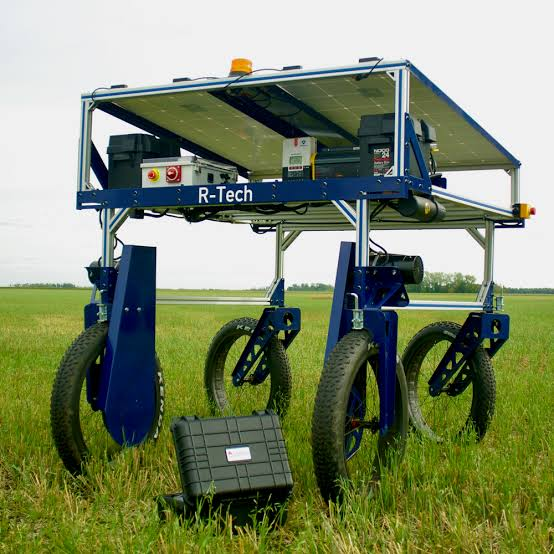
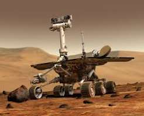

```
Number: 1
Title: Initial Design Scope
Date: 16/09/2026
By: aryan-git-byte
```

It will be a rover that can autonomously map a farm, its nutritional values, image crops, and constantly monitor nutrients etc in the farm.
reference images:


Something between these, a rover type of bot that can move freely in farms with good structure, and reasonable speed with payload of 5 kg(targetted maximum weight incl. of battery, electronics, payloads etc) 

feature scope:
- A 7 in 1 soil sensor that will measure the soil's vital parameters. sensor we'll be using - https://robu.in/product/multi-parameter-sensor/
- A drill type mechanism that will loosen the soil before the sensor can be inserted,so the sensor doesnt take any hit!
- Consisting of 4 wheels.
- a camera that can scan the images of leaf, and crops to analyze them
- LiDar sensor
- IMU, GPS, LTE (for autonomous control), RF (for control with station)
- Solar Chargable

The PCBs of this board will be on different Boards such as:
1. Power Board
2. Actuator and Motor Board
3. Computer carrier
4. communication Board

they will all communicate with each other, with the Carrier board being the main board with Radxa CM3 (2gb/8gb )

