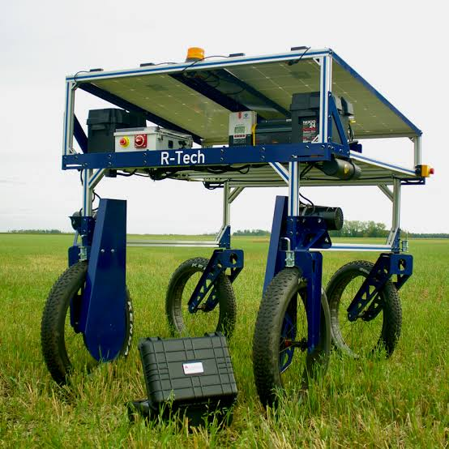
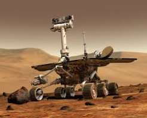

```
Number: 1
Title: Initial Design Scope
Date: 16/09/2026
By: aryan-git-byte
```

It will be a rover that can autonomously map a farm, its nutritional values, image crops, and constantly monitor nutrients etc in the farm.
reference images:


Something between these, a rover type of bot that can move freely in farms with good structure, and reasonable speed with payload of 5 kg(targetted maximum weight incl. of battery, electronics, payloads etc) 

feature scope:
- A 7 in 1 soil sensor that will measure the soil's vital parameters. sensor we'll be using - https://robu.in/product/multi-parameter-sensor/
- A drill type mechanism that will loosen the soil before the sensor can be inserted,so the sensor doesnt take any hit!
- Consisting of 4 wheels.
- a camera that can scan the images of leaf, and crops to analyze them
- LiDar sensor
- IMU, GPS, LTE (for autonomous control), RF (for control with station)
- Solar Chargable

The PCBs of this board will be on different Boards such as:
1. Power Board
2. Actuator and Motor Board
3. Computer carrier
4. communication Board

they will all communicate with each other, with the Carrier board being the main board with Radxa CM3 (2gb/8gb )
```
Number: 1
Title: 
Date: 19/09/2026
By: Abhinav
```
Drive Motor

We will use the DC Geared Motor with Encoder by DFRobot which has high torque as in harsh situations the robot would need more torque to move through the wet mud and small rocks in the soil.

Link: https://wiki.dfrobot.com/fit0522/#tech_specs

Lidar Sensor

The robot would have a Benewake TF-LUNA Micro LiDAR to dodge the obstacles and prevent collison into them as camera can have mis info and would need a lot of tuning to perfect it. 


```
Number: 3
Title: Change in design scope
Date: 20/09/2026
By: aryan-git-byte
```
Changed the Radxa cm3 to raspberry pi CM4


```
Number: 4
Title: Scoping out the CM4 carrier board
Date: 20/09/2026
By: aryan-git-byte
```

The CM4 board would need to analyze the whole surrounding locally on the rover. 
the goal of this CM4 board would be to manage:
camera
LiDar 
IMU
has can transceiver
RTC
Speaker
Mic
1 USB ports
1 HDMI

```text
Number: 5
Title: Checking out libraries needed for Coding
Date: 27/09/2026
By: Abhinav
```

i found a site which is showing how to use the RPI cam with opencv for coding.
Link: https://opencv.org/configuring-raspberry-pi-for-opencv-camera-cooling/

Libraries needed:
python3-picamera2
python3-opencv
python3-numpy and some more but mainly these are needed for rasberry pi

```
Number: 6
Title: Scoping out the Radio Board
Date: 03/10/2026
By: Aryan-git-byte
```
The radio board need to have the LTE module along with antenna connectors, it will also have the RF receiver to be controlled with transmitter.
also would have the GPS and connectors to be interfaced with the main board . it will be probably be made as a shield for that 2x20 rp connector.
and yeah LoRa for the RF

```
Number: 6
Title: Scoping out the Power Board
Date: 04/10/2026
By: Aryan-git-byte
```

To scope this out i would first need to calculate my power consumption.
on the main board we have a CM4, USB-A, Fan, TF Luna which totals around ( 2A + 0.5A + 0.4A + 0.2A) 3.1A
and on the 3v3 rail lets take 1A for worse case

now on radio board we need 1A for peak at sim7080 - so 1.5A here in 3v3 line as its powered from that!

On motor driver board, we have 5 motors and 6 MG996R with 3A stall current each. so 33A - FAHH. 

total we got

5V - 4A
6V - 35A
3v3 - 3A

kk now decieded, the power board would need to delive

3v3 at 3A
5v at 4A
6v1 at 15A
6v2 at 15A

for charging, there would be a solar onboarded on the rover of (values tbd), along with a charger (that too tbd).
the battery shall report its charge to the cm4 and other data too
